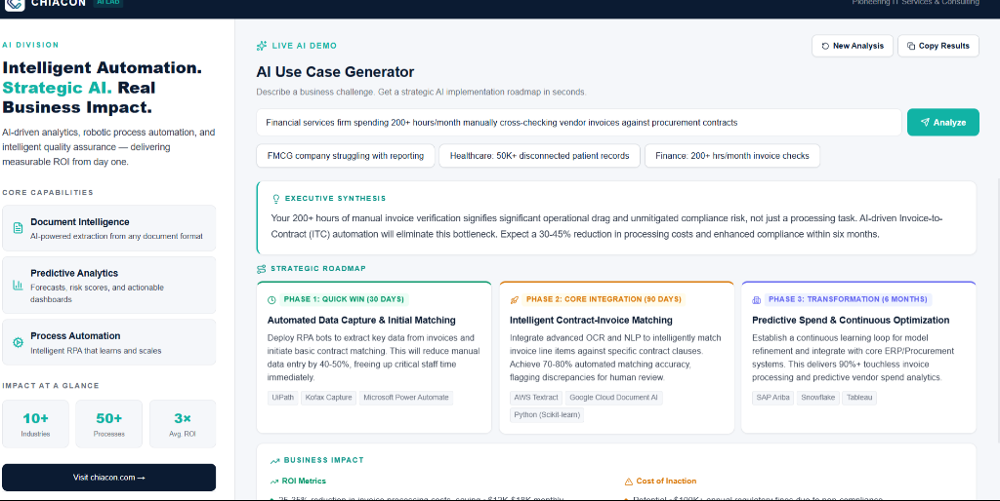
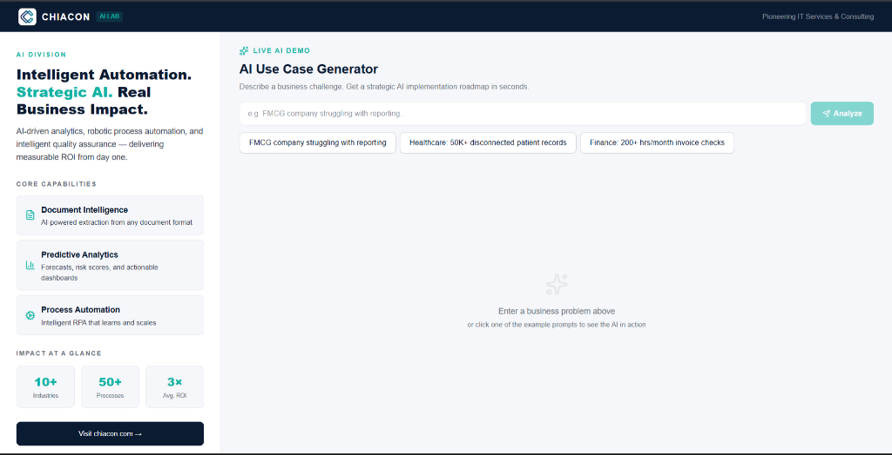

# Chiacon AI Lab - Intelligent Automation Platform

This is the repository for the **Chiacon AI Lab** frontend and backend systems, featuring the **AI Use Case Generator** — a tool that turns business problems into strategic AI implementation roadmaps instantly.


<br/>


## Tech Stack

- **Frontend:** React, Vite, Tailwind CSS (via inline tokens), Lucide React
- **Backend:** FastAPI, Python, Google Gemini (2.5 Pro & Flash)
- **AI Integration:** Google GenAI SDK with structured output (`response_schema`) and advanced prompting.

## Project Structure

This is a monorepo setup containing both the frontend and backend:

- `/frontend` - The React Vite application
- `/backend` - The FastAPI server

## Local Development

### Backend Setup
1. Navigate to the backend directory:
   ```bash
   cd backend
   ```
2. Set up a virtual environment and install dependencies:
   ```bash
   pip install -r requirements.txt
   ```
3. Create a `.env` file with your Gemini API key:
   ```env
   GEMINI_API_KEY=your_api_key_here
   ```
4. Run the FastAPI development server:
   ```bash
   uvicorn main:app --reload --port 8000
   ```

### Frontend Setup
1. Navigate to the frontend directory:
   ```bash
   cd frontend
   ```
2. Install dependencies:
   ```bash
   npm install
   ```
3. Run the Vite development server:
   ```bash
   npm run dev
   ```

## Deployment Info

### Backend (Render / Railway)
- Deploy the `/backend` directory.
- Start Command: `uvicorn main:app --host 0.0.0.0 --port $PORT`
- Environment Variables required: `GEMINI_API_KEY`

### Frontend (Vercel / Netlify)
- Deploy the `/frontend` directory.
- Build Command: `npm run build`
- Output Directory: `dist`
- Environment Variables required: `VITE_API_URL` (pointing to your deployed backend URL).

## Features
- **Intelligent Fallback:** Uses `gemini-2.5-pro` for quality, but automatically falls back to `gemini-2.5-flash` if rate limits or errors occur.
- **Structured JSON Output:** Utilizes Gemini's structured output schema feature to guarantee perfectly formatted roadmaps every time.
- **Clean UI:** Responsive, accessible, and fast interface built with React.
- **Animations:** Engaging loading states and staggered results animations.

---
*Built by Chiacon Consulting*
